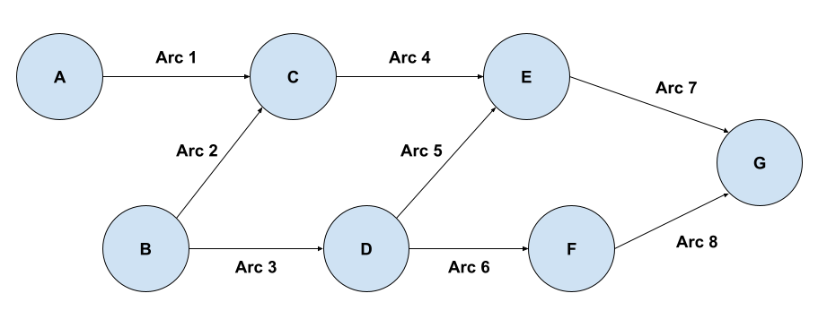
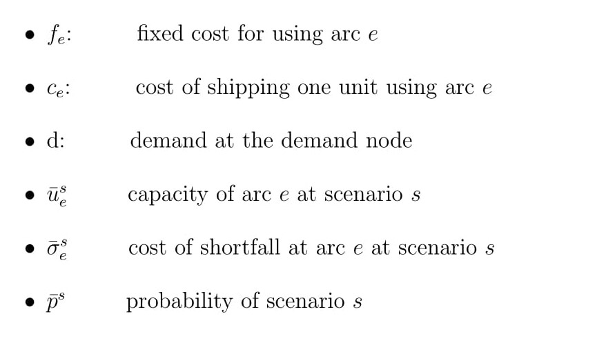

# A-Two-Stage-Stochastic-Transportation-Problem-Modeled-by-Linear-Programming-(OPL/CPLEX)

This study proposes a two-stage stochastic programming model of a transportation network with arc capacities. Our objective is to transport a supply of raw materials from one location (node) to another using different arcs with finite and random capacity, to satisfy requirements with minimum cost. Each location is set to be a supply node, transshipment node, or a demand node. The arcs of the base network represent the connecting routes between the facilities. The motivation of this study is to propose a simple transportation network to see if we must open all arcs to satisfy the demand while minimizing the total cost of shipments. While the demand is known, we decide which arc to use to allocate the raw materials in the first stage. The second stage decides the flow on each arc while minimizing the cost and meeting the demand. The objective function consists of the first-stage decision costs and the expected value of the second-stage recourse costs that will also include the penalty cost of not satisfying demand requirements.

## The Transportation Network

In our network model (shown above), node A and B are supply nodes, node C, D, E, F are transshipment nodes, and node G is a demand node. 

## Notations
Before we model the linear program, let us first define the notations used in this work as follows:

### Decision Varibales

### Input Parameters
The following are the notations for the parameter input data that we have used as following (we have used a bar sign to indicate the stochastic ones):

## Linear Programming Model
Now we will define our linear program as follows

